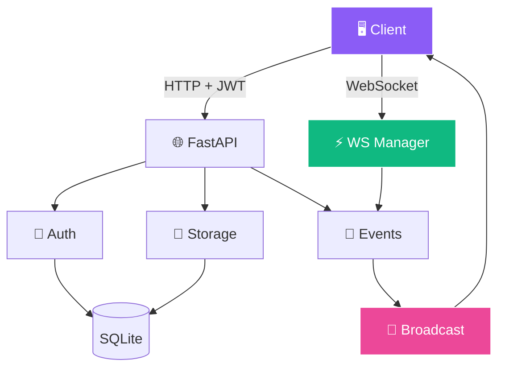

<!-- ═══════════════════════════════════════════════════════════════ -->
<!-- 📋 Collab Task Board — Kanban + Live Sync Animated README -->
<!-- ═══════════════════════════════════════════════════════════════ -->

<!-- ═══════ KANBAN-STYLE HEADER ═══════ -->
<div align="center">
  
</div>

<!-- ═══════ LIVE SYNC INDICATOR ═══════ -->
<div align="center">
  
</div>

<br/>

<!-- ═══════ KANBAN PREVIEW (CARD STYLE) ═══════ -->
<div align="center">

<table border="0" cellspacing="10" cellpadding="10" width="90%">
<tr>
<td align="center" width="25%" bgcolor="#1a1b27">

### 📝 TODO


</td>
<td align="center" width="25%" bgcolor="#1a1b27">

### 🚧 IN PROGRESS


</td>
<td align="center" width="25%" bgcolor="#1a1b27">

### 👀 REVIEW


</td>
<td align="center" width="25%" bgcolor="#1a1b27">

### ✅ DONE


</td>
</tr>
</table>

</div>

<br/>

<!-- ═══════ AI SCENES (Project Vibe) ═══════ -->
<div align="center">
  
  
  
</div>

<br/>

<!-- ═══════ LIVE BADGES ═══════ -->
<div align="center">
  <a href="https://github.com/sumit966/collab-task-board/stargazers">
    
  </a>
  <a href="https://github.com/sumit966/collab-task-board/network/members">
    
  </a>
  <a href="https://github.com/sumit966/collab-task-board/issues">
    
  </a>
  <a href="https://github.com/sumit966/collab-task-board/commits/main">
    
  </a>
</div>

<br/>

<div align="center">
  
  
  
  
  
  
</div>

<br/>

<div align="center">
  
  
  
  
</div>

<br/>

<div align="center">
  <i>📋 Full-Stack Backend Project · Author: <b>Sumit Raj</b> · M.Tech VNIT Nagpur · Ex-Salesforce</i>
</div>

<br/>


---

## 🎯 Overview


A **production-style task board backend** that demonstrates:

<table>
<tr>
<td width="25%" align="center">

### 🔐 Auth


Register + Login

</td>
<td width="25%" align="center">

### 👥 RBAC


Member vs Admin

</td>
<td width="25%" align="center">

### ⚡ Real-Time


Live broadcast

</td>
<td width="25%" align="center">

### 🎯 Type-Safe


Clean models

</td>
</tr>
</table>

> **🎯 Purpose:** A shared task board that **syncs instantly across multiple users** — no refresh, no polling, just live updates.

---

## ❌ Problem Statement

Teams need a shared task board that:

| ❌ Challenge | Impact |
|-------------|--------|
| 🔄 **Syncs instantly** across users | No refresh needed |
| 🔐 **Prevents unauthorized access** | Per-user data isolation |
| 👥 **Distinguishes roles** | Only admins can manage certain things |
| 🪶 **Works without heavyweight infra** | Simple SQLite + FastAPI |
| 🌐 **Clean API for any frontend** | React, Vue, mobile |

> **Most simple demos skip auth, roles, or real-time sync. This project includes all three.**

---

## ✅ Solution

A **FastAPI service** with:

- 🔐 **JWT auth** on every protected endpoint (Bearer token)
- ⚡ **WebSocket endpoint** `/ws/boards/{id}` that broadcasts changes
- 💾 **SQLite storage** for users, boards, tasks
- 🧩 **Clean separation:** auth → storage → events → API
- 🛡️ **Graceful fallback** if `jose` / `passlib` aren't installed (mock hashing for dev)

---

## 🏗️ Architecture

### 📋 Full Stack Flow



### 📐 ASCII Fallback

```
Client (React/Vue/Mobile)
    |
    |--- HTTP (JWT Bearer) ----> FastAPI
    |                              |
    |                              v
    |                    +------------------+
    |                    |  Auth (JWT)      |
    |                    |  Storage (SQLite)|
    |                    |  Events Manager  |
    |                    +--------+---------+
    |                             |
    |--- WebSocket ----+          |
    |                  |          |
    |   /ws/boards/{id}          |
    |                  v          v
    |            Broadcast on task change
    |                             |
    +<--------------------------+
```

---

## 🛠️ Tech Stack

<table align="center">
<tr>
<td><b>Category</b></td>
<td><b>Technologies</b></td>
</tr>
<tr>
<td>🌐 API</td>
<td>  </td>
</tr>
<tr>
<td>⚡ Real-time</td>
<td></td>
</tr>
<tr>
<td>🔐 Auth</td>
<td>  </td>
</tr>
<tr>
<td>💾 Storage</td>
<td></td>
</tr>
<tr>
<td>🧪 Testing</td>
<td>  </td>
</tr>
<tr>
<td>🐳 Container</td>
<td></td>
</tr>
<tr>
<td>⚙️ CI/CD</td>
<td></td>
</tr>
<tr>
<td>🐍 Language</td>
<td></td>
</tr>
</table>

---

## 📦 Project Structure

```
collab-task-board/
│
├── 🐍 src/
│   ├── __init__.py
│   ├── 🔐 auth.py             # JWT + password hashing
│   ├── 💾 storage.py          # SQLite schema + CRUD
│   └── ⚡ events.py           # WebSocket connection manager
│
├── 🌐 api/
│   ├── __init__.py
│   └── main.py                # HTTP + WebSocket endpoints
│
├── 🧪 tests/
│   ├── __init__.py
│   └── test_api.py            # pytest tests
│
├── 📊 data/                    # SQLite db (git-ignored)
├── ⚙️ .github/workflows/ci.yml
├── 🐳 Dockerfile
├── 📋 requirements.txt
├── 📋 requirements-optional.txt
├── 🔐 .env.example
├── 🚫 .gitignore
├── 📜 LICENSE
└── 📖 README.md
```

---

## 🚀 Quick Start

<div align="center">
  
  
</div>

<br/>

### 1️⃣ Clone

```bash
git clone https://github.com/sumit966/collab-task-board.git
cd collab-task-board
```

### 2️⃣ Virtual Environment

**Windows:**

```bash
python -m venv venv
venv\Scripts\activate
```

**macOS / Linux:**

```bash
python3 -m venv venv
source venv/bin/activate
```

### 3️⃣ Install Dependencies

```bash
pip install -r requirements.txt
```

### 4️⃣ Start the API

```bash
uvicorn api.main:app --reload
```

**Runs at** http://localhost:8000

### 5️⃣ Open Swagger

```bash
http://localhost:8000/docs
```

---

## 🔌 API Usage

### 🔵 POST `/register`

**Request:**

```json
{
  "username": "sumit",
  "password": "securepass123",
  "role": "member"
}
```

**Response:**

```json
{
  "access_token": "eyJhbGc...",
  "token_type": "bearer"
}
```

### 🔵 POST `/login`

Same payload as register. Returns a **fresh JWT**.

### 🟢 GET `/me`

Returns the current user. Requires **Bearer token**.

### 🔵 POST `/boards`

**Request:**

```json
{ "name": "Sprint 42" }
```

**Response:**

```json
{ "id": 1, "name": "Sprint 42", "owner_id": 1 }
```

### 🔵 POST `/tasks`

**Request:**

```json
{
  "board_id": 1,
  "title": "Implement login page",
  "description": "React + JWT",
  "assignee_id": 2
}
```

**Response:** full task object.

### 🟡 PATCH `/tasks/{id}`

**Request:**

```json
{ "status": "in_progress" }
```

**Valid statuses:** `todo` | `in_progress` | `review` | `done`

### 🟢 GET `/boards/{id}/tasks`

Returns all tasks in a board.

### ⚡ WebSocket `/ws/boards/{id}?token=JWT`

Connect from any WebSocket client. Receives events:

```json
{ "type": "connected", "board_id": 1 }
{ "type": "task_created", "task": {...} }
{ "type": "task_updated", "task": {...} }
{ "type": "tasks_snapshot", "tasks": [...] }
```

Send `{ "type": "refresh" }` to request a full snapshot.

### 📋 Other Endpoints

| Endpoint | Method | Purpose |
|----------|:------:|---------|
| 🔵 `/` | 🟢 GET | API info |
| 💚 `/health` | 🟢 GET | Health check |
| 🟢 `/me` | 🟢 GET | Current user |
| 🟢 `/users` | 🟢 GET | List users |
| 🟢 `/boards` | 🟢 GET | List boards |
| 📘 `/docs` | 🟢 GET | Swagger UI |

---

## ⚡ WebSocket Example (Python)

```python
import asyncio
import websockets
import json

async def listen():
    url = "ws://localhost:8000/ws/boards/1?token=YOUR_JWT"
    async with websockets.connect(url) as ws:
        await ws.send(json.dumps({"type": "refresh"}))
        async for msg in ws:
            print(json.loads(msg))

asyncio.run(listen())
```

---

## 👥 Role-Based Access

<table>
<tr>
<td width="50%" valign="top" align="center">

### 👤 Member


- ✅ Create boards
- ✅ Create tasks
- ✅ Update tasks
- ❌ Admin endpoints

</td>
<td width="50%" valign="top" align="center">

### 🔑 Admin


- ✅ Everything member can do
- ✅ Admin-only endpoints
- ✅ Manage users
- ✅ Full board control

</td>
</tr>
</table>

> 💡 Admin check implemented as a **FastAPI dependency** (`require_admin`) so it can be applied to any endpoint.

---

## 🎯 WebSocket Manager Design

<table align="center">
<tr>
<td width="50%" valign="top">

### 🧠 Core Design

- 📦 `manager.rooms`: `dict[board_id, set[WebSocket]]`
- 📢 `manager.broadcast(board_id, message)`: sends JSON to every client
- 🧹 Dead connections removed automatically on send failure
- 🔒 `asyncio.Lock` keeps concurrent connect/disconnect safe

</td>
<td width="50%" valign="top">

### 🎯 Rooms Pattern

- 🎯 Each board = one room
- 🔕 Clients only receive updates for **their board**
- 🧹 No cross-board noise
- ⚡ Scales to thousands of connections

</td>
</tr>
</table>

---

## 🧪 Testing

```bash
pytest tests/ -v
```

**Tests cover:**

- 🟢 Root + health
- 🔐 Register and `/me` flow
- ❌ Unauthorized access returns **401**
- 📋 Full board + task lifecycle

---

## 🐳 Docker

### 🔨 Build

```bash
docker build -t collab-task-board .
```

### ▶️ Run

```bash
docker run -p 8000:8000 collab-task-board
```

---

## ⚙️ CI/CD

Every push to `main` triggers GitHub Actions:

```
╔══════════════════════════════════════════════════╗
║              GITHUB ACTIONS WORKFLOW             ║
╠══════════════════════════════════════════════════╣
║                                                  ║
║  [1/2] 📥 Install Python 3.11 + deps            ║
║       │                                          ║
║       ▼                                          ║
║  [2/2] 🧪 Run pytest (TestClient)               ║
║       │                                          ║
║       ▼                                          ║
║  ✅ PASSED                                       ║
║                                                  ║
╚══════════════════════════════════════════════════╝
```

> 📄 See `.github/workflows/ci.yml`

---

## 🎓 Key Learnings

<table>
<tr>
<td width="50%" valign="top">

### 🧠 Real-Time Insights

- 🎯 **WebSocket "rooms" per board** prevent cross-board noise
- 🔐 **JWT works on WebSocket** via query string (`?token=...`)
- 📢 **Broadcast fan-out must handle dead connections** gracefully
- 🧹 **TestClient supports HTTP** but not WebSocket

</td>
<td width="50%" valign="top">

### 🛠️ Engineering Insights

- 🎯 **FastAPI dependency injection** makes role checks clean (`require_admin`)
- 💾 **SQLite `row_factory`** gives dict-like rows for direct JSON responses
- 🛡️ **Graceful fallback to mock hashing** keeps dev friction-free
- 🔒 **asyncio.Lock** keeps concurrent connect/disconnect safe

</td>
</tr>
</table>

---

## 🚀 Future Improvements

| 🌟 | Feature |
|:--:|---------|
| 🎨 | **React / Vue frontend** with drag-and-drop columns |
| 👥 | **Board membership** + invite system |
| 💬 | **Task comments**, attachments, activity log |
| 📧 | **Notification emails** on assignment |
| 🍃 | **MongoDB backend** (already scaffolded) |
| 🚦 | **Rate limiting** per user |
| 🔴 | **Redis pub/sub** for horizontal scaling |
| ☁️ | **Deploy to GCP Cloud Run** with Cloud SQL |

---

## 👤 Author

<div align="center">


<br/><br/>

<b>M.Tech Applied AI & ML @ VNIT Nagpur</b><br/>
<i>Ex-Software Engineer Intern @ Salesforce</i>

<br/><br/>

<a href="https://sumit966.github.io">
  
</a>
<a href="https://www.linkedin.com/in/er-sumit-raj-/">
  
</a>
<a href="https://github.com/sumit966">
  
</a>
<a href="mailto:info.sr0909@gmail.com">
  
</a>

<br/><br/>


</div>

---

## 📄 License

<div align="center">


<br/>


<br/><br/>

<samp>
Released under the <b>MIT License</b> — see <a href="LICENSE">LICENSE</a> file.
</samp>

<br/><br/>

<sub><samp>© 2025 &nbsp;·&nbsp; SUMIT RAJ &nbsp;·&nbsp; ALL RIGHTS RESERVED</samp></sub>

<br/>


</div>

<br/>

<!-- ═══════ WORKING AI SCENES FOOTER ═══════ -->
<div align="center">
  
  
  
</div>

<br/>

<!-- ═══════ KANBAN FOOTER ═══════ -->
<div align="center">
  
</div>
